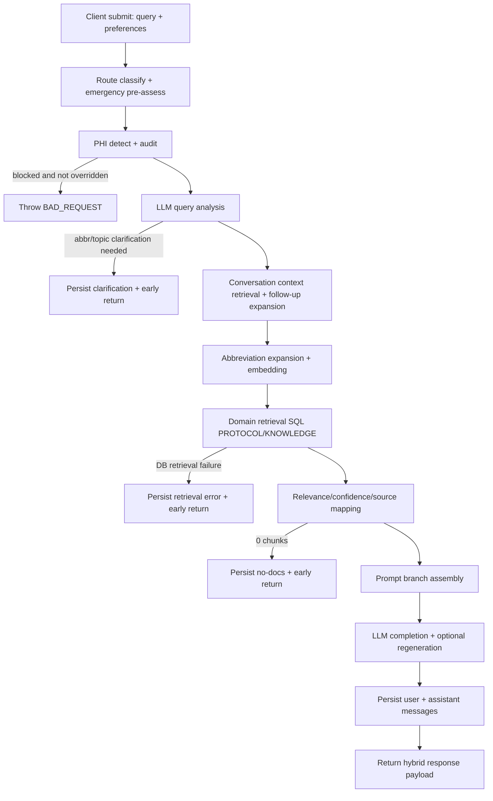

# RAG Resource Hierarchy Audit

Scope: `packages/api/src/routers/rag.ts` `chat` mutation and all directly-invoked dependencies, plus client mutation call path in web chat UI.

## 1. Execution Flow Diagram



## Stage 0: Input Validation and Route Seed

**Files:** `packages/api/src/routers/rag.ts` > `ragRouter.chat` (lines 388-413); `packages/api/src/lib/query-domain-classifier.ts` > `classifyQueryDomain()` (lines 98-125); `packages/api/src/lib/query-routing-safety.ts` > `resolveEffectiveQueryRoute()` (lines 4-16); `packages/api/src/lib/emergency-detection.ts` > `assessEmergency()` (lines 24-119)  
**Inputs:** tRPC input payload (`query`, `conversationId`, `category`, `institution`, `outputStyle`, `userDepartment`, `modelId`, `phiOverride`)  
**Outputs:** `queryDomain`, `queryEmergencyAssessment`, initial `effectiveQueryRoute`, `shouldSearchProtocol`, `shouldSearchKnowledge`  
**Side effects:** console logs  
**Short-circuits:** none  
**Config dependencies:** query-domain signal regex sets in `query-domain-classifier.ts`; emergency rules from `RAG_CONFIG.EMERGENCY_KEYWORDS`/`SEVERITY_ESCALATORS`/`CRITICAL_THRESHOLDS`

The pipeline starts by classifying query domain (`PROTOCOL`/`KNOWLEDGE`/`HYBRID`), then computes emergency severity and applies emergency safety routing override (`KNOWLEDGE` -> `HYBRID` when urgent/emergency). This route controls downstream retrieval domains before any vector search is executed.

## Stage 1: PHI Validation and Audit Logging

**Files:** `packages/api/src/routers/rag.ts` > chat step 1 (lines 430-468); `packages/shared/src/phi-filter.ts` > `detectPotentialPHI()` (lines 867-998), `prepareAuditData()` (lines 1062-1076), `isOverridableBlock()` (lines 1120-1123)  
**Inputs:** raw `query`, `phiOverride` boolean, authenticated user id  
**Outputs:** `phiResult`; proceed or block decision  
**Side effects:** writes `pHIDetectionLog` row via Prisma (lines 443-454); console error if logging fails  
**Short-circuits:** throws `TRPCError(BAD_REQUEST)` if blocked PHI and no override (lines 463-466)  
**Config dependencies:** PHI patterns and override policy in `packages/shared/src/phi-filter.ts`

Server-side PHI detection runs unconditionally. If PHI is blocked, the router logs audit metadata and only proceeds when block is overridable and `phiOverride === true`; otherwise it throws before any retrieval/generation.

## Stage 2: Emergency Baseline and Query Analysis

**Files:** `packages/api/src/routers/rag.ts` > steps 2 and 2.5 (lines 470-705); `packages/api/src/lib/query-analyzer.ts` > `shouldAnalyzeQuery()` (lines 339-347), `analyzeQuery()` (lines 280-333), `assessInterventionRisk()` (lines 187-229); `packages/api/src/lib/topic-detector.ts` > `analyzeTopics()`/`getBoostCategory()` (lines 423-488); `packages/api/src/lib/clarification-guard.ts` > `resolveAbbreviationClarificationCandidate()` (lines 15-62); `packages/api/src/lib/knowledge-topic-detector.ts` > `getKnowledgeBoostCategory()` (lines 251-257)  
**Inputs:** `query`, `category`, current route flags  
**Outputs:** `queryAnalysis` (optional), `effectiveCategory`, `detectedTopicInfo`, initial `interventionRisk`  
**Side effects:** may create conversation + persist user/assistant clarification messages (lines 542-581, 629-660)  
**Short-circuits:**  
- Abbreviation clarification early return (lines 583-597)  
- Topic clarification early return (lines 662-674)  
**Config dependencies:** topic definitions and confidence thresholds in `topic-detector.ts`; analyzer prompt/schema in `query-analyzer.ts`

If protocol retrieval is in scope and query looks analyzable, the router asks an LLM to detect topic, ambiguity, urgency, and intervention risk. Ambiguity can halt the main pipeline and return an explicit clarification response after persisting messages. If analyzer is skipped/fails, keyword topic fallback is used.

## Stage 3: Conversation Context and Follow-up Query Expansion

**Files:** `packages/api/src/routers/rag.ts` > step 3 (lines 707-849)  
**Inputs:** `conversationId`, current `query`, prior conversation messages  
**Outputs:** `conversationContext`, possibly expanded `effectiveQuery`, follow-up signals, `priorAssistantRouteHint`  
**Side effects:** Prisma read `message.findMany` for last 10 messages (lines 727-732); console logs  
**Short-circuits:** none  
**Config dependencies:** hardcoded limits (`take: 10`, message slice `800`, follow-up/query-length heuristics)

If a conversation exists, the router loads recent messages and builds a text history block. For short/referential follow-ups, it rewrites the retrieval query with previous user/assistant context (lines 805-820), so conversation history can influence both retrieval query and prompt context.

## Stage 4: Route Continuity Override and Intervention Context Completeness

**Files:** `packages/api/src/routers/rag.ts` (lines 826-857)  
**Inputs:** current route, follow-up flags, prior assistant route hint, query+conversation text  
**Outputs:** possibly overridden `effectiveQueryRoute`; refreshed `interventionRisk`, `contextCompleteness`, `missingContextFields`  
**Side effects:** console logs  
**Short-circuits:** none  
**Config dependencies:** route override logic is hardcoded in router

Knowledge-only route can be upgraded to `HYBRID` for follow-up continuity if prior assistant context indicates protocol/hybrid history. Intervention risk is re-assessed using combined query plus conversation context before retrieval and prompt safety gating.

## Stage 5: Abbreviation Expansion and Embedding Generation

**Files:** `packages/api/src/routers/rag.ts` > step 4 (lines 860-873); `packages/api/src/lib/abbreviation-detector.ts` > `expandAbbreviationsForRetrieval()` (lines 380-416); `packages/api/src/lib/llm-client.ts` > `generateEmbedding()` (lines 484-495)  
**Inputs:** `effectiveQuery`, `effectiveCategory`  
**Outputs:** `queryForEmbedding`, `expansions`, `queryEmbedding: number[]`  
**Side effects:** outbound OpenAI embeddings API call  
**Short-circuits:** none in router; embedding errors propagate (no local catch)  
**Config dependencies:** embedding model hardcoded in `llm-client.ts` as `text-embedding-3-small`; text truncation to 32000 chars before embedding

Abbreviations are expanded when context can resolve them, improving embedding recall. The embedding call is mandatory for retrieval; if it fails, `rag.chat` fails with an uncaught mutation error.

## Stage 6: Vector Retrieval and Domain Reconciliation

**Files:** `packages/api/src/routers/rag.ts` > step 5 (lines 875-1331); helper `runDomainSearch()` (lines 1015-1125); `packages/api/src/lib/query-routing-safety.ts` > `reconcileRouteAfterRetrieval()` (lines 23-46)  
**Inputs:** `queryEmbedding`, `effectiveQueryRoute`, `effectiveCategory`, `institution`, teams-tier settings  
**Outputs:** `searchResults`, optional `guidelineContext` + `guidelinePromptBlock`, optional `retrievalFailure`  
**Side effects:** multiple Prisma `$queryRaw` calls; console logs  
**Short-circuits:** no return yet, but retrieval exceptions are captured into `retrievalFailure`  
**Config dependencies:** `RAG_CONFIG.MAX_SEARCH_RESULTS`, teams tier config, category boost (`1.20` hardcoded), rank constants (`rankK=60`, guideline similarity `0.55`)

Retrieval is domain-aware: PROTOCOL search includes institutional authority filtering, KNOWLEDGE search does not. Route fail-open behavior probes the opposite domain if single-domain search is empty, then route reconciliation can upgrade to `HYBRID` based on available hits.

## Stage 7: Retrieval Failure Early Return

**Files:** `packages/api/src/routers/rag.ts` > step 6 (lines 1339-1411)  
**Inputs:** `retrievalFailure`, `query`, possibly missing `convId`  
**Outputs:** error response payload with `confidence: 0`, no sources  
**Side effects:** may create conversation, persist user+assistant messages, update conversation timestamp  
**Short-circuits:** returns immediately on retrieval failure (line 1400)  
**Config dependencies:** none

If SQL retrieval fails (e.g., schema mismatch), the router persists an assistant error message with retrieval diagnostics in metadata and returns without attempting prompt generation.

## Stage 8: Relevance Filtering, Confidence, and Source Mapping

**Files:** `packages/api/src/routers/rag.ts` > step 7 (lines 1413-1553)  
**Inputs:** `searchResults`, `effectiveQuery`, thresholds from config  
**Outputs:** `topSimilarity`, `confidence`, `hasRelevantContent`, `resultsForLLM`, `citationSources`, `verbatimSources`, finalized `emergencyAssessment`  
**Side effects:** console logs/warnings  
**Short-circuits:** none  
**Config dependencies:** `MIN_CONFIDENCE_THRESHOLD`, `MIN_DISPLAY_SIMILARITY`, `MIN_DISPLAY_SIMILARITY_KNOWLEDGE`, `MAX_VERBATIM_SOURCES`

Confidence is derived from top retrieval score (`similarity * category_boost + tier_adjustment`, capped at 1.0). Display filtering uses raw similarity thresholds (with keyword-overlap guard for borderline hits), then mapped sources are converted into internal citations (`/api/policies/...` for protocol; `null` URL for knowledge sources).

## Stage 9: No-Documents Early Return

**Files:** `packages/api/src/routers/rag.ts` > step 8 (lines 1555-1637)  
**Inputs:** empty `searchResults`, route type  
**Outputs:** no-docs response payload  
**Side effects:** may create conversation, persist user+assistant messages, update conversation timestamp  
**Short-circuits:** returns immediately when no chunks retrieved  
**Config dependencies:** none

If retrieval yields zero chunks, the router persists and returns a route-specific “no indexed sources found” response. No LLM generation is attempted.

## Stage 10: Prompt Branch Assembly

**Files:** `packages/api/src/routers/rag.ts` > step 9 prompt build (lines 1639-2016); `packages/api/src/lib/knowledge-governance.ts` (lines 1-127)  
**Inputs:** `resultsForLLM`, `conversationContext`, route/source profile, emergency status, `outputStyle`, `userDepartment`, `modelId`, guideline and teams blocks  
**Outputs:** `systemPrompt`, `currentBranch`, resolved `effectiveStyle`  
**Side effects:** none  
**Short-circuits:** none  
**Config dependencies:** output-style auto heuristics and branch order hardcoded in router

Prompt structure branches in this order: `KNOWLEDGE_ONLY` -> `HYBRID` -> `EMERGENCY` -> `ROUTINE` -> `LOW_CONFIDENCE`. The selected model name is embedded in the identity preamble, but chat message structure remains system+user across providers.

## Stage 11: LLM Completion, Post-Formatting, Validation, and Optional Regeneration

**Files:** `packages/api/src/routers/rag.ts` > step 9 completion (lines 2018-2103); `packages/api/src/lib/llm-client.ts` > `generateCompletion()` (lines 411-473); `packages/api/src/lib/concise-format.ts` (lines 88-128); `packages/api/src/lib/response-validator.ts` > `validateResponse()` (lines 82-162)  
**Inputs:** `systemPrompt`, raw `query`, `maxTokens`, `temperature`, selected `modelId`  
**Outputs:** `processedContent`, `validation`, `regenerationAttempted`, optional `guidelineContext.deltaNote`, completion provider/model  
**Side effects:** outbound LLM API calls (one or two); console logs  
**Short-circuits:** none; failures throw if all providers fail  
**Config dependencies:** max output tokens hardcoded in router; provider fallback chain in `llm-client.ts`

The model output may be reformatted for concise mode, then policy-validated. Regeneration is attempted once only when validator reports `requiresRegeneration` (critical violations threshold met), and the second pass is re-validated.

## Stage 12: Conversation Persistence and Final Return

**Files:** `packages/api/src/routers/rag.ts` > steps 10-11 (lines 2105-2261)  
**Inputs:** final response text/sources/confidence/metadata and `convId`  
**Outputs:** `ChatResponse` payload returned to client  
**Side effects:** create conversation if absent; persist user message + assistant message + metadata; update conversation `updatedAt`; compute fallback-used flag  
**Short-circuits:** final return only  
**Config dependencies:** none

The router persists both messages and returns a hybrid payload containing both render-ready sources (`citationSources`, `verbatimSources`) and debug metadata. Notably, returned `confidence` is decimal 0-1, while persisted metadata `confidence` uses the percentage integer computed earlier.

---

## 2. Resource Priority and Retrieval Order

### Exact Vector Search SQL / `$queryRaw` Calls (in `rag.chat`)

1. **Schema capability probe** (for tier/source columns): `rag.ts` lines 932-969.
2. **Domain retrieval (`runDomainSearch`)**:
   - **Category-match query** (`category_boost = 1.20`), lines 1030-1059
   - **Non-category query** (`category_boost = 1.0`), lines 1061-1090
   - **Unfiltered query** (no category split), lines 1095-1123
3. **Guideline retrieval query** (national/society guideline candidates), lines 1186-1201.

Core similarity clause is always:

```sql
1 - (dc.embedding <=> ${queryEmbedding}::vector) as similarity
ORDER BY dc.embedding <=> ${queryEmbedding}::vector
```

### Institution Filter Application

- **SQL-level filter only** (no post-filter pass): `AND d.institution = ${institution}::"Institution"` in `runDomainSearch` when `applyInstitutionFilter` is true (lines 1021-1023).
- PROTOCOL calls `runDomainSearch("PROTOCOL", true, "INSTITUTIONAL_ONLY")` (line 1146), so institution filter applies there.
- KNOWLEDGE calls `runDomainSearch("KNOWLEDGE", false)` (line 1149), so institution never filters knowledge retrieval.

### Category Boost Math and the 20%

- Category-match query hardcodes `1.20 as category_boost` (line 1049), i.e. **+20% multiplier**.
- Final ranking score function:  
  `score = similarity * category_boost + tier_adjustment` (lines 914-915).
- Tier adjustment adds `+0.05` for teams reference docs (when conditions true) and `-0.03` for educational docs (lines 997-1008, from config).

### How Retrieval Limits/Thresholds Gate Results

- `MAX_SEARCH_RESULTS` (8) controls:
  - dedupe/rank slice in category mode (line 929),
  - unfiltered query LIMIT (line 1122),
  - HYBRID post-RRF slice (line 1283).
- `MIN_CONFIDENCE_THRESHOLD` (0.50) gates `hasRelevantContent` using top scored hit (line 1423).
- `HIGH_CONFIDENCE_THRESHOLD` is defined but **unused** in `rag.chat`.
- Source-display gating uses:
  - protocol: `MIN_DISPLAY_SIMILARITY` (0.52),
  - KNOWLEDGE: `MIN_DISPLAY_SIMILARITY_KNOWLEDGE` (0.55),
  - plus keyword-overlap check for borderline hits (lines 1443-1454).

### Can Institution A + Institution B Results Mix?

Yes. If institution is unset (“All Sources”), protocol SQL omits institution predicate, so chunks from both institutions can be returned together in one response.

### `MAX_CONTEXT_TOKENS` Truncation Behavior

`MAX_CONTEXT_TOKENS` is configured but **not enforced in `rag.chat`**. Effective truncation is instead by:

- retrieval count cap (`MAX_SEARCH_RESULTS`),
- conversation history cap: 10 messages, 800 chars each,
- guideline excerpt cap: 6000 chars,
- no explicit token-based cut of source chunks before prompt assembly.

### Conversation History in Retrieval vs Generation

- **Retrieval:** yes, conditionally. For follow-up/referential queries, `effectiveQuery` is expanded with prior user/assistant context before embedding (lines 805-820, then embedding line 872).
- **Generation:** yes. `conversationContext` is appended into system prompt branches (e.g. lines 1814-1821, 1861, 1904, 1985, 2012).

---

## 3. Context Assembly (Prompt Construction)

### System Prompt Templates and Branching

`systemPrompt` is built in `rag.ts` lines 1741-2016 with branch order:

1. `KNOWLEDGE_ONLY` (no protocol sources, has knowledge): lines 1744-1821
2. `HYBRID` (protocol + knowledge): lines 1823-1865
3. `EMERGENCY` (urgent/emergency): lines 1866-1913
4. `ROUTINE` (has relevant content): lines 1914-1989
5. `LOW_CONFIDENCE`: lines 1990-2016

Inputs affecting prompt selection/content:

- source profile (`hasProtocolSources`, `hasKnowledgeSources`)
- emergency severity
- `outputStyle` resolved to `effectiveStyle` (auto heuristics lines 1681-1697)
- `institution` display naming (lines 1670-1675)
- `userDepartment`
- teams/guideline blocks
- model display name in identity preamble

### Message Roles Sent to Model

`generateCompletion` is called with:

- `systemPrompt`: assembled branch template
- `userMessage`: raw current query only
- **no assistant prefill** in `rag.chat`

Provider wrappers map this to provider-specific request shapes (`llm-client.ts`):

- OpenAI-like providers: `[system, user]`
- Anthropic: `system` + `messages: [{role:"user", ...}]`

### Verbatim Source Injection Format

- Shared source context block (`contextForLLM`, lines 1664-1668):
  ```
  [SOURCE N | DOMAIN: "Document Title"]
  chunk content
  [END SOURCE N]
  ```
- Knowledge-only branch uses `knowledgeContextSection` formatting with optional `URL:` lines (lines 1751-1761).

### Conversation History Injection

- History text created from up to 10 prior messages, each truncated to 800 chars (lines 727-742).
- Injected as plain text section in system prompt for each branch when non-empty.
- No explicit token-budget split by section; all assembled blocks are concatenated.

### Does `modelId` Change Prompt Structure?

- It changes provider/model endpoint and fallback behavior (`llm-client.ts`).
- It also changes model label in identity preamble (`modelName`, lines 1644-1645, 1729-1737).
- It does **not** fundamentally change message role structure (still system+user).

---

## 4. Post-Generation Processing

1. **Concise formatting** (`concise-format.ts`)  
   Applied only when concise mode + routine + non-emergency branch (lines 2043-2050; helper lines 88-96).

2. **Response validation** (`response-validator.ts`)  
   Checks first-person language, banned verbs, protected lexicon, invasive qualification, etc. (lines 2052-2057).

3. **Optional single regeneration**  
   If `requiresRegeneration` true, appends correction prompt and regenerates once (lines 2059-2088).

4. **Guideline delta extraction**  
   Regex-scrapes “National Guideline Context” from generated text and stores short note if present (lines 2090-2102).

5. **Confidence derivation**  
   From retrieval top score only (`scoreSearchResult`), capped at 1.0 (lines 1417-1423). Not from LLM self-rating.

6. **Verbatim source selection**  
   `citationSources = resultsForLLM.map(...)`; `verbatimSources = first MAX_VERBATIM_SOURCES` (lines 1549-1553).

7. **Emergency assessment attachment**  
   Attached from pre-generation detection pipeline (`queryEmergencyAssessment` -> `emergencyAssessment`), not generated by LLM (line 1482 onward).

8. **Citation handling**  
   LLM inline `[Source: "..."]` markers are preserved in text, but structured source arrays are injected from retrieval mapping; no citation extraction parser from model output.

---

## 5. Fallback and Error Paths

### LLM Fallback Chain (`llm-client.ts`)

`generateCompletion()` tries:

1. requested model/provider first (lines 417-439)
2. fallback sequence (lines 447-456):
   - Claude Sonnet 4.6
   - GPT-5.2
   - DeepSeek R1
   - Gemini 3.0
   - MiniMax-M2.5
   - Claude Haiku 4.5
   - Kimi K2.5
   - Claude Opus 4.6

Provider attempt returns `null` on missing key, timeout, or provider error; final throw if all fail (line 472).

### Vector Search Returns No Results

- If SQL succeeds but `searchResults.length === 0`, router persists a no-docs assistant response and returns early (lines 1559-1637).
- If hits exist but all are below display threshold, router still builds `resultsForLLM` from top `MAX_VERBATIM_SOURCES` fallback (line 1463) and continues to generation (often `LOW_CONFIDENCE` branch).

### Embedding Generation Fails

No local catch around `generateEmbedding` in `rag.chat`; error bubbles to tRPC mutation failure.

### LLM Empty or Malformed Output

- Provider wrappers default empty content to `"Unable to generate response."` (e.g., lines 164-165, 217-218, 259-260, 301-302, 344-345, 382-383).
- No schema validation of final assistant text in `rag.chat` beyond governance validator.

### Abbreviation Clarification Needed

Pipeline halts early, persists clarification messages, and returns a clarification payload (`needsAbbreviationClarification: true`) without retrieval/generation (lines 527-597).

---

## 6. Feature Flags and Configuration Sources

## `packages/api/src/lib/rag-config.ts` (authoritative for API RAG behavior)

- `MIN_CONFIDENCE_THRESHOLD = 0.50` -> prompt branch gate (`hasRelevantContent`) in `rag.ts` line 1423.
- `HIGH_CONFIDENCE_THRESHOLD = 0.70` -> currently unused in `rag.chat`.
- `MAX_SEARCH_RESULTS = 8` -> retrieval and post-merge caps (lines 929, 1122, 1283).
- `MAX_VERBATIM_SOURCES = 3` -> source panel and fallback context cap (lines 1463, 1552).
- `MIN_DISPLAY_SIMILARITY = 0.52` / `MIN_DISPLAY_SIMILARITY_KNOWLEDGE = 0.55` -> per-source display filtering (lines 1436-1439).
- `MAX_CONTEXT_TOKENS = 8000` -> configured, not enforced in `rag.chat`.
- `EMERGENCY_KEYWORDS`, `SEVERITY_ESCALATORS`, `CRITICAL_THRESHOLDS` -> used in `assessEmergency()`.
- `TEAMS_TIER_CONFIG`:
  - `SOURCE_COLLECTION` / trigger keywords / `REFERENCE_BONUS` / `EDUCATIONAL_PENALTY` / blocked categories / `SOURCE_COLLECTION_T1_CONDITION` -> used in tier scoring logic.
  - `CLINICAL_ADJUSTMENT` currently unused.
- `EMBEDDING_MODEL`, `EMBEDDING_DIMENSIONS` -> defined here but runtime embedding model is separately hardcoded in `llm-client.ts`.

## `packages/shared/src/constants.ts` (legacy)

- Legacy `RAG_CONFIG` (`MIN_CONFIDENCE_THRESHOLD=0.6`, `MAX_SEARCH_RESULTS=5`, etc.) is **not** used by `rag.chat`.
- It is referenced by `apps/web/src/lib/rag/search.ts` (which is currently unused by app runtime).

## `apps/web/src/stores/preferences.ts` (client-side values passed to mutation)

- `outputStyle` (default `auto`) -> passed to `rag.chat`.
- `department` -> passed as `userDepartment`.
- `selectedModelId` (default from shared `DEFAULT_MODEL_ID`) -> passed as `modelId`.
- `selectedInstitution` -> passed as `institution`.
- `showConfidenceScores`, `autoExpandSources` -> UI rendering only.
- `crossChatMemoryEnabled` -> preference exists, not sent to `rag.chat`.

## Environment Variables (LLM + embeddings)

Read in `packages/api/src/lib/llm-client.ts`:

- `OPENAI_API_KEY` -> OpenAI chat + embeddings client
- `ANTHROPIC_API_KEY` -> Claude models
- `DEEPSEEK_API_KEY` -> DeepSeek
- `GEMINI_API_KEY` -> Gemini
- `MINIMAX_API_KEY` -> MiniMax
- `MOONSHOT_API_KEY` -> Kimi/Moonshot

Behavioral impact:
- Missing provider key marks that provider unavailable (returns `null` for that attempt).
- Embeddings always require OpenAI client path.

## Hardcoded Behavioral Values in `rag.ts`

- Prior message fetch count `10`; per-message history truncation `800` chars
- Follow-up expansion snippets `400` chars
- Category query limits `5` (in-category) + `3` (out-of-category)
- RRF `rankK = 60`
- Guideline candidate threshold `0.55`; max guideline chars `6000`
- Completion temperature `0.2`; output max tokens: `900/1200/1500/1800` branch-based

---

## 7. Dead Code and Planned/Unreachable Paths

1. **Discrepancy detection module not wired into `rag.chat`**
   - `packages/api/src/lib/discrepancy-detection.ts` is not imported by router.
   - Prompt mentions “Discrepancy Note” (hybrid response structure), but no discrepancy engine invocation occurs.
   - File imports `DISCREPANCY_CONFIG` from `@rad-assist/shared`, which is not present in shared exports.

2. **Legacy client RAG utility unused**
   - `apps/web/src/lib/rag/search.ts` has no imports in `apps/web/src`.
   - Its legacy prompt/embedding utilities do not participate in current tRPC `rag.chat` flow.

3. **Unused exports/imports**
   - `TopicAnalysis` type imported in `rag.ts` but unused.
   - `analyzeAbbreviations()` export in `abbreviation-detector.ts` appears unused by API runtime.

4. **Config entries currently unused in live chat path**
   - `HIGH_CONFIDENCE_THRESHOLD`
   - `MAX_CONTEXT_TOKENS`
   - `TEAMS_TIER_CONFIG.CLINICAL_ADJUSTMENT`
   - `rag-config.ts` embedding fields (runtime uses hardcoded llm-client embedding model constant)

5. **`AnalyzeQueryOptions` context fields effectively dormant in `rag.chat`**
   - `analyzeQuery()` supports `conversationContext/prior...`, but `rag.ts` calls `analyzeQuery(query)` without options.

---

## Critical Questions (Explicit Answers)

1. **Is there any live web search in the RAG pipeline?**  
   **No.** Retrieval is internal pgvector SQL over `DocumentChunk`/`Document`. There is no web-search call in `rag.chat`.

2. **Can a single response contain chunks from both Institution A and Institution B when filter is “All Sources”?**  
   **Yes.** With no institution filter, protocol retrieval omits the institution predicate, so Institution A and Institution B chunks can appear together.

3. **Does conversation history affect retrieval, or only generation?**  
   **Both.** Retrieval is affected conditionally via follow-up query expansion before embedding; generation is affected via injected conversation history block in prompt.

4. **What is the actual token budget breakdown?**  
   - User query input: max 2000 chars (schema)  
   - Conversation history: up to 10 messages * 800 chars (hard cap by slicing)  
   - Retrieved chunks: up to 8 chunks (or 3 fallback), no token-based truncation  
   - Guideline context: capped at ~6000 chars  
   - Output token cap: branch-based `maxTokens` = 900 / 1200 / 1500 / 1800  
   - `MAX_CONTEXT_TOKENS` exists in config but is not applied in `rag.chat`.

5. **Is response confidence derived from retrieval similarity or something else?**  
   **Retrieval-derived.** It comes from top scored retrieval hit (`similarity * category_boost + tier_adjustment`, capped at 1.0), not from LLM self-assessment.

6. **Are there race conditions/conflicts (e.g., abbreviation clarification vs emergency detection)?**  
   **There are ordering conflicts:**  
   - Clarification early-returns use `emergencyAssessment` initialized to routine before reassignment, so emergency state can be lost on clarification responses.  
   - Teams tier bonus condition is computed before final emergency reassignment, so urgent/emergency queries can still satisfy a routine-only bonus check.

7. **What percentage of pipeline is synchronous vs could be parallelized?**  
   Approximate runtime view: **~75-85% of latency-critical I/O is serialized today** (LLM/classifier/analyzer, embedding, domain searches, completion, persistence).  
   Potential parallelization headroom: **~30-40% wall-clock reduction opportunity** by parallelizing independent calls (notably protocol+knowledge searches, some pre-retrieval analysis/context fetch), while preserving dependency-ordered gates (PHI block, early clarification, final persistence ordering).
